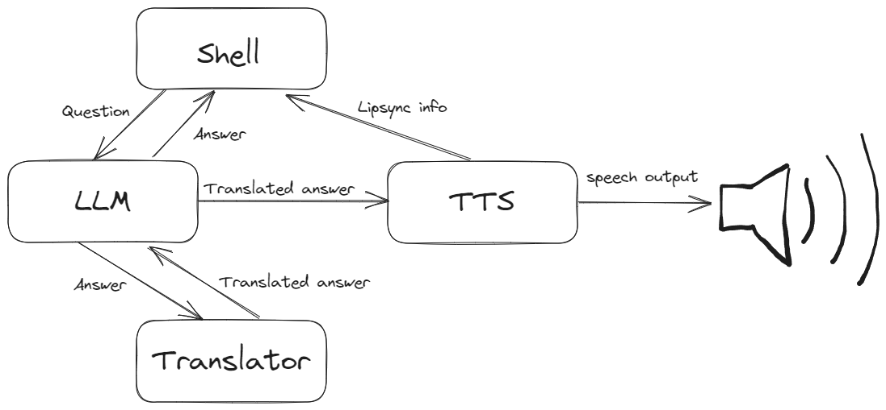
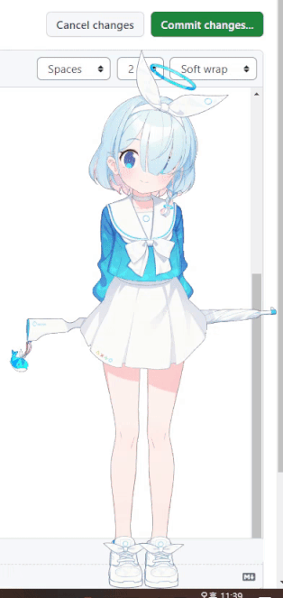

# DesktopARONA

Operation CWAL of [*"...아로나 또한 비서로 개발되어 나올 가능성이 있을까요?"*](https://m.inven.co.kr/webzine/wznews.php?site=bluearchive&idx=265523).

※ **Model files not included**

>## v1

https://github.com/FENRlR/DesktopARONA-temp/assets/31113971/065f3057-f16e-4d26-b018-b6897c4847c7

Demonstration of v1 with polyglot module.

## Overall structure 

### - Shell

Base : Java - libgdx spine runtime

Targeted screen size : 1080p

Get a copy of the spine model from somewhere else, then place it to `./aronares`.

※ [Implemented method for lipsync](https://github.com/FENRlR/Simple-mouth-shape-recognition-using-euclidean-distance-in-real-time-tts-audiostream) is quite different from that of in-game example (which was added much later).

### - LLM
Base : Python - kobart or polyglot

- kobart

  Finetuned KoBART from [KoBART-chatbot](https://github.com/haven-jeon/KoBART-chatbot).

  Fast, but generates a fixed answer for a given sentence (encoder-decoder).
  
  To make it work on windows OS, you need to solve an error (as far as I remember, that was something related to type conversion in torch).
  
- polyglot

  EleutherAI's [polyglot-ko-1.3b](https://huggingface.co/EleutherAI/polyglot-ko-1.3b) finetuned with datasets of [KoAlpaca](https://github.com/Beomi/KoAlpaca).
  
  Slow, even with time limits - can be better if you have a modern gpu ~~(probably better than my old 970m)~~. Also takes a lot of Vram.
  
  To make it work on windows OS, you need bitsandbytes modified for windows and some additional struggles for manual dtype allocations by opening up the library and fixing it.

  
### - TTS
Base : Python - [mb-istft-vits-multilingual](https://github.com/misakiudon/MB-iSTFT-VITS-multilingual)

- Model from https://huggingface.co/FENRlR/extra/tree/main/tts

### - Translator
Base : Python - ezTransWeb-omni

There are some clumsy requirements for this. Please refer to https://github.com/FENRlR/ezTransWeb-omni.

## Limitations
- Bug in PMA
- Without PMA, the sprite innates white borders and slight transparancy
- Limited options for the window

>## v2
### - Shell

Base : C# - SpineViewerWPF

Targeted screen size : 1080p

※ **WIP** - now with correct representation of PMA but I have to reconstruct it all the way up again...
## Plans
- Customized language model with emotion embeddings 
- Lipsync options (in-game style amplitude based vs freq based)
- Functional interaction (simple search, opening something, etc. - ideas needed)
- STT (not my style but if needed)

## Limitations 
- GPU usage goes up and hits nearly 50% in GTX970m when monitored with task manager, despite of the actual usage of ~14%
- Not stable (at least in my system) - execution of other programs makes it disappear for unknown reason
